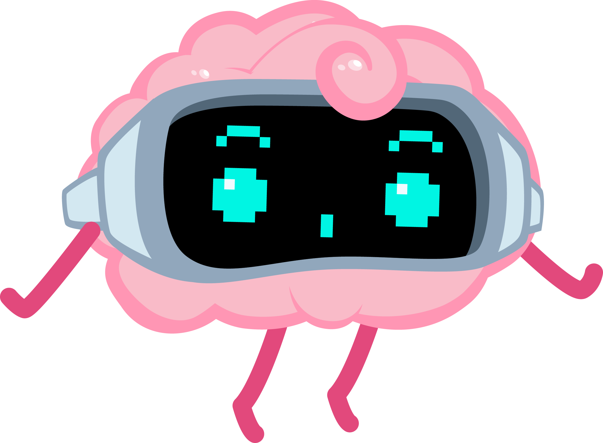

### TL;DR

If you only have limited time to learn Artificial Intelligence, here’s what I recommend:

- 📘 **Read this book**: [AI Engineering: Building Applications with Foundation Models](https://www.oreilly.com/library/view/ai-engineering/9781098166298/)  
- 🎥 **Watch this video**: [Deep Dive into LLMs like ChatGPT](https://youtu.be/7xTGNNLPyMI?si=aUTq_qUzyUx36BsT)  
- 🧠 **Follow this course**: [🤗 Agents Course](https://huggingface.co/learn/agents-course/)

If you want more (and there’s a lot more) keep reading.

## Why this repo exists
Learning often feels like walking down a road that forks every few meters; you’re always exploring, never really arriving. And that’s the beauty of it.

When I was working in games, people would ask me: “How do I learn to make games?” My answer was always: “Pick a game, and build it, learn the tools and concepts along the way.” I’ve taken the same approach with AI.

This repository is a collection of the material I’ve used (and continue to use) to learn AI: books, courses, papers, tools, models, datasets, and notes. It’s not a curriculum, it’s more like a journal. One that’s helped me build, get stuck, and keep going.

Do I know AI? Not really. But I’m learning, building, and having a great time doing it.

I hope something in here is useful to you too. And if you have suggestions or feedback, I’d love to hear it.

## Books

Here are my top 5 recommended books to make sense of AI/ML/DL:

- [AI Engineering: Building Applications with Foundation Models](https://www.oreilly.com/library/view/ai-engineering/9781098166298/) If you feel lost and don't know where to start, this book can serve as a great map. Chip explains the most common concepts behind AI in a clear and approachable way.
- [Hands-On Large Language Models: Language Understanding and Generation](https://www.oreilly.com/library/view/hands-on-large-language/9781098150952/) Building an LLM from scratch is difficult, even understanding existing open-source options can be challenging. This book does a great job of explaining how LLMs work and introduces common architectures at a deep enough level to be practical without being overwhelming.
- [Deep Learning - A Visual Approach](https://www.glassner.com/portfolio/deep-learning-a-visual-approach/) Probably the best resource out there for building solid intuition about the many concepts surrounding deep learning. Andrew, the author, did a wonderful job illustrating these concepts, making it much easier to develop a real understanding of them.
- [Deep Learning](https://www.deeplearningbook.org/) The most complete and in-depth book on Deep Learning. It's dense but thorough, covering the math, statistics, and core algorithms that form the foundation of modern AI. It helped me build a clearer mental model of the tools used in research and implementation.
- [Practical Deep Learning for Coders with Fastai and PyTorch: AI Applications Without a PhD](https://course.fast.ai/Resources/book.html) This book comes with video lectures by [Jeremy Howard](https://x.com/jeremyphoward), the author and creator of FastAI. The goal is to give coders a head start in deep learning without diving too deep into the weeds.

[See the full list of books](/books.md)

## Courses & Tutorials

Not everyone learns the same way, sometimes I get too tired of just reading, and tutorials or courses in video form make me feel like I’m talking to someone.
If you prefer learning through videos or more interactive formats, I recommend taking a look at the following materials:

- [Getting Started with Deep Learning](https://learn.nvidia.com/courses/course?course_id=course-v1:DLI+S-FX-01+V1) A short introduction to deep learning, delivered by NVIDIA. If you just want a quick glimpse of the very basics before jumping into higher-level implementation, this is a solid place to start.
- [MIT Intro to Deep Learning](http://introtodeeplearning.com/) A free, intensive bootcamp taught by MIT researchers. Getting direct access to this content (updated every time they teach it) is amazing. (~10 hours of deep learning concepts, plus interesting guest lectures.)
- [Practical Deep Learning for Coders](https://course.fast.ai/) This is the accompanying course version of the FastAI book by [Jeremy Howard](https://x.com/jeremyphoward).
- [C++ Neural Network in a Weekend](https://www.jeremyong.com/cpp/machine-learning/2020/10/23/cpp-neural-network-in-a-weekend/) This might be too much if you’re just starting out, or if you’re not interested in low-level C++ implementations of neural networks. But I found it fascinating, and it made me appreciate how far modern frameworks and APIs have come.
- [🤗 Agents Course](https://huggingface.co/learn/agents-course/) Now that agentic AI is trending, Hugging Face launched this free course showcasing their `smolagents` framework. It also covers LlamaIndex and LangGraph. 

## Videos & Talks
I find it increasingly difficult these days to stay focused on videos. Maybe it’s because watching usually means being on a computer or phone, and distractions are always just a click away.  
However, the videos listed here are so well-made, well-researched, and genuinely interesting that I believe they’re not just useful, but sticky.
One more thing I appreciate: in the world of AI, many of the best video talks and tutorials often come directly from the people actually building the models, frameworks, and tools. What a great time to be learning.

- [Andrej Karpathy: Software Is Changing (Again)](https://youtu.be/LCEmiRjPEtQ?si=3osbmpa4XjRDazJa) This session is great session outlining how the way we talk to computers is changing. We're still just transforming data, but the way we do so, is changing. I think this is particularly useful for software developers, Computer Scientists, and students who wonder if a CS career is worth it in 2025.
- [Transformers (how LLMs work) explained visually](https://youtu.be/wjZofJX0v4M?si=AdcRXv8GtgIZTqkw) 3Blue1Brown’s beautifully and clearly explained video on how large language models (LLMs) work, including the transformer architecture and the concept of embeddings.
- [Visualizing transformers and attention | Talk for TNG Big Tech Day '24](https://youtu.be/KJtZARuO3JY?si=rWDYNLAteyWnhHju) Grant Sanderson's (3Blue1Brown) live explanation on how to think visually about transformers. This session is at the intersection of art and science.
- [Deep Dive into LLMs like ChatGPT](https://youtu.be/7xTGNNLPyMI?si=aUTq_qUzyUx36BsT) Aderej Karpathy's(OpenAI, Tesla, Stanford) masterclass on how LLMs work. In-depth, but super accesible.
- [Let's build GPT: from scratch, in code, spelled out.](https://www.youtube.com/watch?v=kCc8FmEb1nY&t=2095s) Andrej Karpathy's step-by-step guide on building GPT.

## Tools, Frameworks & Platforms

Understanding all the tools, frameworks, architectures, and ecosystems around AI can sometimes feel harder than understanding AI itself. Below are the ones I’ve explored and used enough to feel confident recommending.  
Of course, these won’t solve every use case, and I’m not listing every supporting technology you might need to build real-world AI systems, but it’s a start.

| Category         | Tools  |
|------------------|--------|
| Core Frameworks   |   - [**Hugging Face**](https://huggingface.co/): A hub, that hosts models, datasets, apps, and communities around AI.   - [**Ollama**](https://ollama.com/): Run LLMs locally in your computer(CLI).   - [**LM Studio**](https://lmstudio.ai/): Discover, and run LLMs in your computer, using a UI.|
| Developer Tools   |   - [**Gradio**](https://www.gradio.app/): Create ML-powered apps for the web. Easy to use UI API.   - [**Google Colab**](https://colab.research.google.com/): You have seen probably many resources use Jupyter Notebooks, this platform allows you to run them.   - [**MongoDB**](https://mongodb.com/): Database that allows you to perform vector search. |
| Visualization Tools   |   - [**LLM Visualization**](https://bbycroft.net/llm): Visualize, and see step-by-step how an LLM works.   - [**Embeddings Vis**](https://arturonereu.com/tools/embeddings): Visualize the resulting embeddings from multiple models, and their semantic distance. In 3D space. |

## Python Libraries & Toolkits

AI goes far beyond any single language, operating system, hardware, or framework. There are countless implementations across different programming languages, runtimes, and platforms. From my experience, though, Python is what most people use and teach.  
Following that path, I’ve focused most of my learning around Python as well. That said, similar libraries (and often the same ones) likely exist for your favorite environment too.

| Category                     | Libraries                  |
|-------------------------------|-----------------------------|
| Data Science & Computation    | Pandas, NumPy, SciPy, scikit-learn |
| Plotting & Visualization      | Matplotlib, Seaborn         |
| Machine Learning / Deep Learning | TensorFlow, PyTorch       |
| Image Processing              | Pillow                      |
| Web Scraping                  | Beautiful Soup, Selenium    |

## Models

At the core of deep learning are the models. Some are general-purpose large language models (LLMs), while others are specialized for specific tasks like text generation, image creation, or coding.

These are the models I’ve used or explored:
- [GPT (OpenAI)](https://platform.openai.com/docs/models)
- [Claude (Anthropic)](https://www.anthropic.com/api)
- [Gemini (Google DeepMind)](https://deepmind.google/technologies/gemini/)
- [LLaMA (Meta)](https://www.llama.com/)
- [DeepSeek](https://huggingface.co/deepseek-ai)
- [Meta Segment Anything Model 2](https://ai.meta.com/sam2/)

If you're looking to explore beyond these, I recommend checking out the following model hubs. They host a wide variety of models with different licenses and for many use cases:
- [Hugging Face Models Hub](https://huggingface.co/models)
- [TensorFlow Hub](https://www.tensorflow.org/hub)
- [NVIDA NGC Catalog](https://catalog.ngc.nvidia.com/models)
- [Roboflow Universe](https://universe.roboflow.com/)

## Articles, Blogs & Interviews

- [AI Is Nothing Like a Brain, and That’s OK](https://www.quantamagazine.org/ai-is-nothing-like-a-brain-and-thats-ok-20250430) - 04/30/25
- [John Carmack: Different path to AGI](https://dallasinnovates.com/exclusive-qa-john-carmacks-different-path-to-artificial-general-intelligence/) - 02/02/23
- Deep Learning in a Nutshell [Part 1: Core Concepts](https://developer.nvidia.com/blog/deep-learning-nutshell-core-concepts/) | [Part 2:  History and Training](https://developer.nvidia.com/blog/deep-learning-nutshell-history-training/) | [Part 3: Sequence Learning](https://developer.nvidia.com/blog/deep-learning-nutshell-sequence-learning/) | [Part 4: Reinforcement Learning](https://developer.nvidia.com/blog/deep-learning-nutshell-reinforcement-learning/) | [Part 5: Reinforcement Learning](https://developer.nvidia.com/blog/deep-learning-nutshell-reinforcement-learning/) - 11/03/2015
- [LLM Visualization](https://bbycroft.net/llm) This interactive article and visualization of how an LLM works (specifically the inference process) is a wonderful resource for reducing the abstraction around LLMs and seeing them in action. It focuses on the nanoGPT model.

## Papers

At the core of most AI advances is research — deep, complex work published by people pushing the boundaries of what’s possible. These breakthroughs often appear in the form of academic papers.
Reading papers can be overwhelming at first. It’s not always easy to unpack their meaning or follow the math. I suggest using tools like [NotebookLM](https://notebooklm.google.com/) or joining a local AI paper-reading club.

[Read the list here](/papers.md)

## Datasets

The current approach to teaching machines relies heavily on data — often, massive amounts of it. In some cases, we use datasets that were created and labeled by humans. In others, we rely on synthetic data generated by machines, or a combination of both.
This section includes some well-known datasets you can explore and use to train your models. Platforms like Hugging Face also host a wide range of datasets for different tasks and domains.

| Name                                                                                                          | Domain                                      |
|---------------------------------------------------------------------------------------------------------------|---------------------------------------------|
| [Kaggle Datasets](https://www.kaggle.com/datasets/)                                                           | Various / General ML                        |
| [CelebA](https://paperswithcode.com/dataset/celeba)                                                           | Computer Vision / Facial Attributes         |
| [COCO](https://cocodataset.org/#home)                                                                         | Computer Vision / Object Detection          |
| [ImageNet](https://image-net.org/)                                                                            | Computer Vision / Classification            |
| [Cityscapes Dataset](https://www.cityscapes-dataset.com/)                                                     | Computer Vision / Segmentation              |
| [ObjectNet](https://objectnet.dev/)                                                                           | Computer Vision / Robustness Testing        |
| [LAION 5B](https://laion.ai/blog/laion-5b/)                                                                   | Multimodal / Vision-Language                |
| [NAIRR Datasets](https://nairrpilot.org/pilotresources)                                                       | Various / Research Datasets                 |
| [UCI Machine Learning Datasets](https://archive.ics.uci.edu/datasets)                                         | Traditional ML / Tabular                    |
| [Common Crawl](https://commoncrawl.org/)                                                                      | NLP / Web-Scale Corpus                      |
| [The Pile](https://pile.eleuther.ai/)                                                                         | NLP / Language Modeling                     |
| [C4 (Colossal Clean Crawled Corpus)](https://www.tensorflow.org/datasets/community_catalog/huggingface/c4)    | NLP / Pretraining Corpus                    |

## Notes & Highlights
- [Standard Notations for Deep Learning](https://cs230.stanford.edu/files/Notation.pdf)
- [AI Index Report | Stanford](https://hai.stanford.edu/research/ai-index-report)
- [Historical data on 'notable' Models by Epoch](https://epoch.ai/data/notable-ai-models)
- [Ethics of AI](https://ethics-of-ai.mooc.fi/)

  

