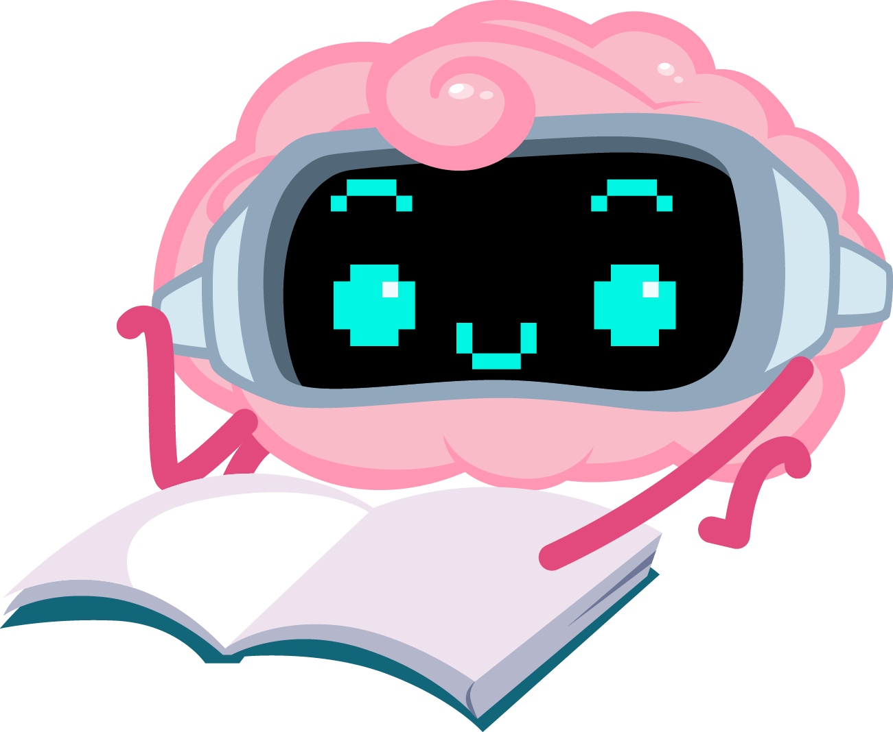

## Books - Extras

To avoid bloating the books section in the [README](/README.md), I’m adding books adjacent to AI, which I see more as food for thought, or as ethical, political, and guidance works.

- [The Third Chimpanzee](https://www.penguinrandomhouse.com/books/220289/the-third-chimpanzee-by-jared-diamond/) This book explores how humans evolved into the ‘third chimpanzee,’ offering lessons for AI developers and designers. From human history and animal behavior, there are patterns we can reflect on. AI won’t be a mammal, so it’s not a ‘fourth chimpanzee,’ but because we are creating it, we should use past lessons to build something beneficial for ourselves and others.

- [The Chaos Machine](https://www.hachettebookgroup.com/titles/max-fisher/the-chaos-machine/9780316703307/) The book shows how many of social media’s problems arose from AI optimizing too narrowly toward specific goals. These examples can serve as warnings as we design chatbots and GPT-style systems.

- [Ways of Being: Animals, Plants, Machines: The Search for a Planetary Intelligence](https://draw-down.com/products/animals-plants-machines-the-search-for-a-planetary-intelligence) This book explores not just artificial intelligence, but the many forms of intelligence that already exist alongside us on Earth. It’s a great source of inspiration and a reminder that intelligence comes in many shapes, most of which we don't understand.

- [Your Brain Is a Time Machine: The Neuroscience and Physics of Time](https://wwnorton.com/books/9780393355604) AI-adjacent, but this book provides an interesting view of how our brains handle time, and how we can bring in ideas to the world of neural networks, as I believe there are untapped opportunities to allow AIs to make better use of the concept and perception of time, particularly when dealing with memory and planning.

- [Everything Is Predictable: How Bayesian Statistics Explain Our World](https://www.goodreads.com/en/book/show/199798096-everything-is-predictable) This book provides a compelling view at how everything in life can be predicted, which essentially is what we are making machines do. Predict data.
